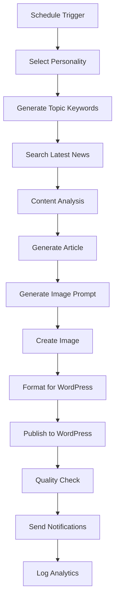

# Plan d'Automatisation Magazine - Journalistes Virtuels 🤖📰

## 🎯 Vue d'ensemble du Projet

### Objectif Principal
Créer un système d'automatisation N8N qui génère du contenu journalistique de qualité avec différentes personnalités virtuelles, publiant automatiquement selon des horaires précis pour alimenter votre magazine.

### Architecture Générale
```
Schedule Trigger → Sélection Personnalité → Recherche Sujet → Génération Article → Génération Image → Publication WordPress → Notifications
```

---

## 🎭 Définition des Personnalités Journalistiques

### 1. **Alex - L'Analyste Tech** 
- **Spécialité**: Technologie, IA, innovations
- **Ton**: Analytique, précis, tourné vers l'avenir
- **Style**: Articles techniques vulgarisés
- **Mots-clés**: "analyse", "impact", "révolution numérique"
- **Sources préférées**: TechCrunch, Wired, ArsTechnica

### 2. **Marie - L'Enquêtrice Société**
- **Spécialité**: Société, politique, économie
- **Ton**: Investigateur, critique, factuel
- **Style**: Enquêtes approfondies, fact-checking
- **Mots-clés**: "investigation", "analyse", "contexte"
- **Sources préférées**: Reuters, AP News, BBC

### 3. **Thomas - Le Passionné Science**
- **Spécialité**: Sciences, recherche, découvertes
- **Ton**: Enthousiaste, éducatif, accessible
- **Style**: Vulgarisation scientifique
- **Mots-clés**: "découverte", "recherche", "innovation"
- **Sources préférées**: Nature, Science, Scientific American

### 4. **Sophie - L'Experte Économie**
- **Spécialité**: Finance, business, marchés
- **Ton**: Professionnel, analytique, pragmatique
- **Style**: Analyses économiques, tendances marché
- **Mots-clés**: "marché", "économie", "tendance"
- **Sources préférées**: Bloomberg, Financial Times, Wall Street Journal

### 5. **Lucas - Le Critique Culture**
- **Spécialité**: Culture, arts, divertissement
- **Ton**: Créatif, passionné, critique constructive
- **Style**: Critiques culturelles, analyses artistiques
- **Mots-clés**: "culture", "art", "créativité"
- **Sources préférées**: Variety, Rolling Stone, Pitchfork

---

## ⏰ Planning de Publication

### Schedule Hebdomadaire Optimisé

| Jour | Heure | Personnalité | Sujet | Objectif |
|------|-------|--------------|-------|----------|
| **Lundi** | 08:00 | Alex (Tech) | Tendances technologiques | Commencer la semaine avec l'innovation |
| **Lundi** | 14:00 | Sophie (Éco) | Analyses marchés | Lunch break content |
| **Mardi** | 09:00 | Marie (Société) | Actualités sociales | Engagement citoyen |
| **Mardi** | 16:00 | Thomas (Science) | Découvertes scientifiques | Éducation après-midi |
| **Mercredi** | 07:30 | Alex (Tech) | Startup & innovations | Milieu de semaine dynamique |
| **Mercredi** | 15:30 | Lucas (Culture) | Critiques culturelles | Pause culturelle |
| **Jeudi** | 08:30 | Sophie (Éco) | Business & finance | Préparation fin de semaine |
| **Jeudi** | 17:00 | Marie (Société) | Enquêtes approfondies | Prime time engagement |
| **Vendredi** | 10:00 | Thomas (Science) | Vulgarisation scientifique | Science accessible |
| **Vendredi** | 19:00 | Lucas (Culture) | Weekend culturel | Préparation weekend |
| **Samedi** | 11:00 | Alex (Tech) | Gadgets & reviews | Weekend tech |
| **Dimanche** | 14:00 | Sophie (Éco) | Analyses hebdomadaires | Bilan économique |

---

## 🏗️ Architecture Technique des Workflows

### 1. **Workflow Principal - Template de Base**

#### Composants Core:
1. **Schedule Trigger** (Cron expressions)
2. **Personality Selector** (Switch node)
3. **Topic Generator** (AI-powered)
4. **Research Engine** (Google Search + Web Scraping)
5. **Content Generator** (OpenAI avec prompts personnalisés)
6. **Image Generator** (Stability AI)
7. **WordPress Publisher**
8. **Quality Control** (Validation automatique)
9. **Notification System** (Multi-canal)

### 2. **Système de Prompts Personnalisés**

#### Structure des Prompts par Personnalité:

**Alex (Tech):**
```
Vous êtes Alex, journaliste tech expert. Analysez les dernières innovations technologiques.
Style: Précis, analytique, prospectif
Longueur: 800-1200 mots
Structure: Introduction → Analyse technique → Impact sociétal → Conclusion prospective
Ton: Professionnel mais accessible
Évitez: Jargon technique non expliqué, sensationnalisme
```

**Marie (Société):**
```
Vous êtes Marie, journaliste d'investigation. Analysez les enjeux sociétaux avec recul critique.
Style: Factuel, investigateur, nuancé
Longueur: 1000-1500 mots
Structure: Contexte → Enquête → Multiples perspectives → Analyse critique
Ton: Sérieux, objectif, engagé
Évitez: Opinions personnelles, sensationnalisme, raccourcis
```

### 3. **Système de Recherche Intelligente**

#### Sources par Domaine:
- **Tech**: TechCrunch, Wired, The Verge, Ars Technica
- **Société**: Reuters, AP News, BBC, Le Monde
- **Science**: Nature, Science, PNAS, Scientific American
- **Économie**: Bloomberg, FT, WSJ, The Economist
- **Culture**: Variety, Rolling Stone, Pitchfork, The Guardian

#### Méthode de Recherche:
1. **Trending Topics** (Google Trends API)
2. **RSS Feeds** (Actualités fraîches)
3. **Social Media** (Twitter/X API pour tendances)
4. **News APIs** (NewsAPI, Guardian API)

---

## 🛠️ Implémentation N8N - Template de Base

### Workflow Structure:



### Nodes Configuration:

#### 1. **Schedule Trigger**
```json
{
  "parameters": {
    "rule": {
      "interval": [{"field": "cronExpression", "value": "0 8 * * 1"}]
    }
  },
  "type": "n8n-nodes-base.scheduleTrigger"
}
```

#### 2. **Personality Selector (Switch Node)**
```json
{
  "parameters": {
    "dataType": "string",
    "value1": "alex_tech",
    "rules": {
      "rules": [
        {"operation": "equal", "value2": "alex_tech"},
        {"operation": "equal", "value2": "marie_society"},
        {"operation": "equal", "value2": "thomas_science"},
        {"operation": "equal", "value2": "sophie_economy"},
        {"operation": "equal", "value2": "lucas_culture"}
      ]
    }
  }
}
```

#### 3. **Topic Generator (OpenAI)**
```json
{
  "parameters": {
    "model": "gpt-4",
    "prompt": "En tant que {{$json.personality}}, générez 3 sujets d'actualité pertinents dans votre domaine. Format: sujet1+sujet2+sujet3",
    "temperature": 0.7
  }
}
```

#### 4. **Advanced Research Engine**
```json
{
  "parameters": {
    "url": "https://newsapi.org/v2/everything",
    "queryParameters": {
      "q": "{{$json.topics}}",
      "sortBy": "publishedAt",
      "language": "fr",
      "pageSize": 10
    }
  }
}
```

#### 5. **Content Generator avec Personality Prompts**
```json
{
  "parameters": {
    "model": "gpt-4",
    "prompt": "{{$json.personality_prompt}} + Rédigez un article basé sur: {{$json.research_data}}",
    "maxTokens": 2000,
    "temperature": 0.8
  }
}
```

---

## 📊 Système de Qualité et Analytics

### 1. **Contrôle Qualité Automatique**
- **Longueur minimum**: 800 mots
- **Détection plaigiat**: API CopyScape
- **Fact-checking**: Validation des sources
- **SEO Score**: Yoast-like analysis
- **Lisibilité**: Score Flesch-Kincaid

### 2. **Analytics et Métriques**
- **Performance articles** (vues, engagement)
- **Efficacité par personnalité**
- **Heures optimales publication**
- **Sujets les plus performants**
- **ROI par type de contenu**

### 3. **Dashboard de Supervision**
- **Status en temps réel** des workflows
- **Alertes en cas d'échec**
- **Métriques de performance**
- **Gestion des contenus en attente**

---

## 🔄 Workflows Spécialisés

### 1. **Workflow d'Urgence** (Breaking News)
- **Trigger**: News API alerts
- **Traitement**: Analyse rapide + article express
- **Publication**: Immédiate avec tag "URGENT"

### 2. **Workflow de Curation** (Weekend)
- **Trigger**: Compilation hebdomadaire
- **Contenu**: Best-of de la semaine
- **Format**: Newsletter + article récapitulatif

### 3. **Workflow Saisonnier**
- **Trigger**: Événements calendaires
- **Contenu**: Articles thématiques (Noël, été, etc.)
- **Planification**: 2 semaines en avance

---

## 🛡️ Sécurité et Backup

### 1. **Sécurisation des APIs**
- **Rotation des clés** API automatique
- **Rate limiting** intelligent
- **Monitoring des coûts** OpenAI/Stability

### 2. **Backup et Recovery**
- **Sauvegarde workflows** quotidienne
- **Base de données articles** redondante
- **Système de rollback** en cas d'erreur

### 3. **Monitoring et Alertes**
- **Status workflows** 24/7
- **Alertes échecs** (Slack/Email/SMS)
- **Performance monitoring**

---

## 🚀 Roadmap d'Implémentation

### Phase 1 (Semaine 1-2): Fondations
- [ ] Configuration workflow de base
- [ ] Intégration APIs essentielles
- [ ] Test personnalité "Alex Tech"

### Phase 2 (Semaine 3-4): Expansion
- [ ] Ajout des 5 personnalités
- [ ] Système de scheduling complet
- [ ] Interface de monitoring

### Phase 3 (Semaine 5-6): Optimisation
- [ ] Analytics avancées
- [ ] Système qualité automatique
- [ ] Workflows spécialisés

### Phase 4 (Semaine 7-8): Production
- [ ] Tests de charge
- [ ] Monitoring 24/7
- [ ] Documentation complète

---

## 💡 Fonctionnalités Avancées (Future)

### 1. **IA Conversationnelle**
- **Chatbot intégré** pour interactions lecteurs
- **Réponses automatiques** aux commentaires
- **Engagement personnalisé**

### 2. **Multi-plateforme**
- **Publication automatique** sur réseaux sociaux
- **Adaptation format** (LinkedIn, Twitter, Facebook)
- **Cross-posting intelligent**

### 3. **Analyse Prédictive**
- **Prédiction tendances** avec ML
- **Optimisation horaires** publication
- **Suggestions sujets** basées sur performance

---

## 📋 Template N8N - Code de Base

### Fichier: `journalist_base_template.json`

```json
{
  "name": "Journalist-Virtual-Template",
  "nodes": [
    {
      "parameters": {
        "rule": {
          "interval": [{"field": "cronExpression", "value": "{{ $json.schedule }}"}]
        }
      },
      "type": "n8n-nodes-base.scheduleTrigger",
      "name": "Schedule Trigger",
      "position": [0, 0]
    },
    {
      "parameters": {
        "assignments": {
          "assignments": [
            {"name": "personality", "value": "{{ $json.selected_personality }}", "type": "string"},
            {"name": "domain", "value": "{{ $json.domain }}", "type": "string"},
            {"name": "style_prompt", "value": "{{ $json.personality_prompt }}", "type": "string"}
          ]
        }
      },
      "type": "n8n-nodes-base.set",
      "name": "Set Personality",
      "position": [200, 0]
    }
  ]
}
```

---

## 🎯 KPIs de Succès

### Métriques Quantitatives
- **Articles publiés/semaine**: 12-15
- **Taux de publication réussie**: >95%
- **Temps moyen génération**: <15 minutes
- **Score qualité moyen**: >8/10

### Métriques Qualitatives
- **Engagement lecteurs** (commentaires, partages)
- **Référencement naturel** (positions Google)
- **Crédibilité journalistique**
- **Diversité des sujets traités**

---

## 📞 Support et Maintenance

### 1. **Documentation**
- **Guide utilisateur** complet
- **Troubleshooting** courant
- **Best practices** personnalisation

### 2. **Formation**
- **Formation équipe** sur monitoring
- **Procédures d'urgence**
- **Optimisation continue**

### 3. **Évolution**
- **Mise à jour** personnalités
- **Nouveaux domaines** d'expertise
- **Intégrations supplémentaires**

---

*Ce plan constitue la base pour créer votre système de magazine automatisé. Chaque section peut être développée selon vos besoins spécifiques et contraintes techniques.*